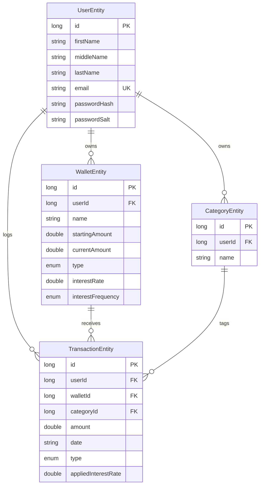

# Database

PocketLedger uses **Room/SQLite** for local persistence. Business rules mirror the finalized database architecture (constraints, triggers, and validation).

## Entity-relationship diagram

## Entities

### users (`UserEntity`)

| Column | Type | Notes |
|--------|------|-------|
| id | LONG PK AUTO | |
| firstName | TEXT | Required |
| middleName | TEXT | Required |
| lastName | TEXT | Required |
| email | TEXT UNIQUE | Validated in UI via regex |
| passwordHash | TEXT | SHA-256 + salt |
| passwordSalt | TEXT | |

### wallets (`WalletEntity`)

| Column | Type | Notes |
|--------|------|-------|
| id | LONG PK AUTO | |
| userId | LONG FK | |
| name | TEXT | |
| startingAmount | REAL | ≥ 0 |
| currentAmount | REAL | Updated on each transaction |
| type | ENUM | CHECKING, SAVINGS, CASH |
| interestRate | REAL NULL | Required for SAVINGS (0–100) |
| interestFrequency | ENUM NULL | DAILY, MONTHLY, YEARLY — SAVINGS only |

### categories (`CategoryEntity`)

| Column | Type | Notes |
|--------|------|-------|
| id | LONG PK AUTO | |
| userId | LONG FK | |
| name | TEXT | Unique per user |

### transactions (`TransactionEntity`)

| Column | Type | Notes |
|--------|------|-------|
| id | LONG PK AUTO | |
| userId | LONG FK | |
| walletId | LONG FK | |
| categoryId | LONG FK | |
| amount | REAL | Must be > 0 |
| date | TEXT | ISO `yyyy-MM-dd`, not future |
| type | ENUM | INCOME, EXPENSE, INTEREST |
| appliedInterestRate | REAL NULL | Required only for INTEREST |

## Business rules

| Rule | Enforced in |
|------|-------------|
| Email regex `^[A-Za-z0-9._%+-]+@[A-Za-z0-9.-]+\.[A-Za-z]{2,}$` | `ValidationUtils` + RegisterPresenter |
| Duplicate email rejected | `AuthStore.register()` |
| Amount > 0 | `TransactionHelper`, TransactionPresenter |
| No future transaction dates | `TransactionHelper`, DatePicker max date in Activity |
| Interest rate only on INTEREST transactions | TransactionPresenter strips rate; `TransactionHelper` validates |
| Savings wallet requires interest fields | `TransactionHelper.createWallet()`, WalletPresenter |
| Interest rate 0–100 for Savings | `TransactionHelper.createWallet()` |
| Wallet balance update on insert | `TransactionHelper.addTransaction()` — INCOME/INTEREST +amount, EXPENSE −amount |
| Insufficient balance on expense | `TransactionHelper.addTransaction()` |

## Default categories

Seeded on registration via `CategorySeeder.seedForUser()`:

- Food & Dining
- Transportation
- Salary
- Tuition
- Subscriptions
- Shopping
- Utilities
- Entertainment

## Key queries

| Query | DAO method | Used by |
|-------|-----------|---------|
| Net worth (sum of wallet balances) | `WalletDao.getNetWorth(userId)` | Dashboard, Profile |
| Income total | `TransactionDao.getIncomeTotal(userId)` | Dashboard |
| Expense total | `TransactionDao.getExpenseTotal(userId)` | Dashboard |
| Ledger (denormalized) | `TransactionDao.getLedgerEntries(userId)` | Dashboard |
| Filter by category | `TransactionDao.getLedgerEntriesByCategory(userId, name)` | Dashboard |
| Search categories | `CategoryDao.searchByUser(userId, query)` | Category screen |

Ledger entries join `transactions`, `wallets`, and `categories` and sort by `date DESC, id DESC` (newest first).

## Session storage

`AuthStore` uses `SharedPreferences` (`SessionPreferences`) for:

- `logged_in` (boolean)
- `user_id` (long)
- `email` (string)

User profile data lives in Room; session only stores the active user id.
